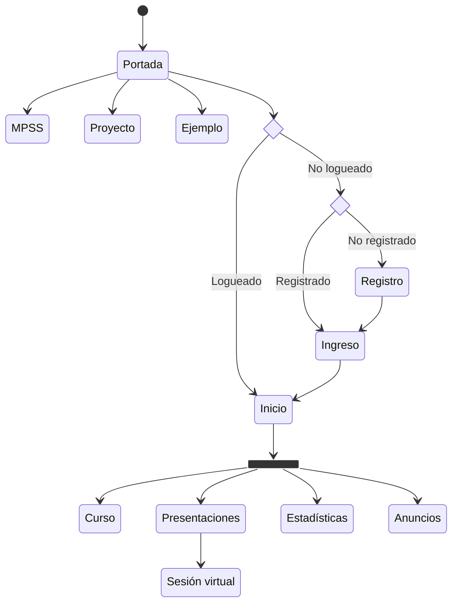

# Desarrollo del software

Esta sección discute el objetivo específico 2 del proyecto: "planificar las tecnologías a utilizar y la metodología de desarrollo de software".

## Tecnologías

La decisión sobre las tecnologías para desarrollo está basada en un análisis sobre plataformas similares presentado en [RATIONALE.md](RATIONALE.md), donde fue determinado que una plataforma de presentaciones web como Reveal.js es la mejor opción para satisfacer las características deseadas, en comparación con otros SaaS (*Software-as-a-Service*) existentes en el mercado. Esta selección, sin embargo, tiene una deficiencia y una debilidad: la deficiencia es que no tiene una plataforma para manejo de usuarios. Esto es solventado con Django en el desarrollo de nuestro proyecto. La debilidad es que su edición es directamente en HTML, CSS y JavaScritp, es decir, requiere conocimiento técnico especializado y no tiene una interfaz gráfica.

Por tanto, las plataformas son:

### Backend: Django

[Django](https://www.djangoproject.com/) es un *framework* de desarrollo web basado en Python.

Aquí es implementado:

- El sistema de usuarios
- El registro de estadísticas de uso
- La interactividad

### Frontend: Reveal.js

[Reveal.js](https://revealjs.com/) es un *framework* de presentaciones HTML, CSS y JavaScript.

Aquí es implementado:

- El diseño visual de las presentaciones
- El contenido de las presentaciones

## Metodología de desarrollo

El proyecto cuenta con la asistencia de una persona de ingeniería de software de la Escuela de Ciencias de la Computación e Informática. A partir de discusiones sobre la idoneidad de la metodología de desarrollo, fue elegido:

- **Metodología**: _Agile_ - Un enfoque iterativo e incremental para el desarrollo de software que enfatiza la flexibilidad y la colaboración y la satisfacción del cliente. De entre las metodologías Agile comunes (Scrum, Kanban y Extreme Programming) elegimos **Kanban**.
- **Herramienta**: _Jira_ - Una herramienta de gestión de proyectos que permite el desarrollo Agile, incluyendo metodologías Scrum y Kanban. Esto nos ayudará a planificar, hacer seguimiento y gestionar el trabajo, además de dar visibilidad en tiempo real sobre el progreso y los problemas.
- **Repositorio**: _GitHub_ - Una plataforma basada en web para el control de versiones y la colaboración que es ampliamente utilizada en el desarrollo de software. Nos permite compartir código, hacer seguimiento de cambios y colaborar en distintas "ramas" del proyecto.
- **Entorno de desarrollo**: _Visual Studio Code_ - Un editor de código con una variedad de características y extensiones para el desarrollo de sitios web. Admite múltiples lenguajes de programación, tiene herramientas de depuración integradas y proporciona características como autocompletado y refactorización de código. Además, nos va a permitir utilizar herramientas de inteligencia artificial recientes.

## Documentación

La documentación del proyecto está presentada en este y los otros documentos disponibles en GitHub. Un primer elemento clave en la documentación de un sitio web es la creación de un mapa del sitio, mostrado a continuación.

### Mapa del sitio

- Portada: Bienvenida e información general del sitio
- Ejemplo: Presentación de ejemplo del sistema para usuarios no registrados
- Registro: Para nuevos usuarios
- Ingreso: Para usuarios registrados
- Inicio: Página de inicio del usuario registrado
- Curso: Material complementario del curso
- Presentaciones: Lista de presentaciones asincrónicas disponibles e ingreso a la siguiente presentación sincrónica
  - Sesión: Presentación para las clases virtual del curso
- Estadísticas: Resumen de estadísticas individuales y colectivas de uso, incluyendo las evaluaciones en las presentaciones
- Anuncios: Información relevante sobre eventos próximos o recientes

## Usuarios

- Visitante: persona sin registro que puede visitar las páginas informativas y la presentación de ejemplo.
- Docente: persona autorizada y registrada que puede comenzar y dirigir las presentaciones y crear nuevas presentaciones, entre otras acciones privilegiadas.
- Estudiante: persona matriculada en el curso y registrada en el sistema que puede participar de las presentaciones del curso y tiene estadísticas de uso, etc.
- Invitado: persona registrada que puede participar de las presentaciones del curso pero no es estudiante.
- Administrador: persona registrada que tiene acceso a todos los privilegios administrativos.

**Nota**: este es un *sistema por invitación*, de forma tal que todas las personas registradas deben ser "pre-aprobadas" por la administración del sistema, posiblemente en una "white list" con los correos electrónicos autorizados para hacer el registro en el sistema.
