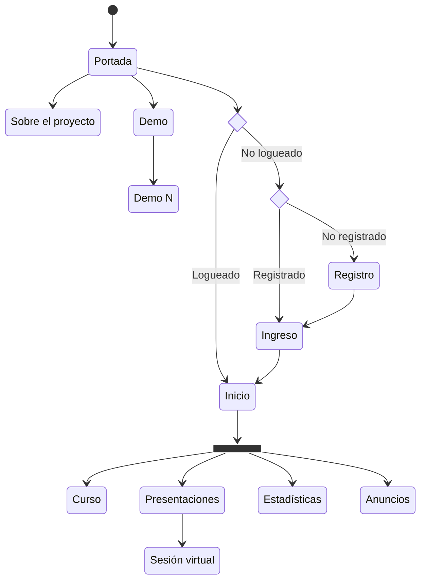

# Estructura del sitio y base de datos

## Aplicaciones

- `courses`: información sobre el o los cursos en la plataforma.
- `decks`: las presentaciones (*slide decks*).
- `website`: páginas misceláneas (inicio, acerca, contacto, etc.).
- `users`: manejo de usuarios, incluyendo estadísticas.

### Mapa del sitio

- Portada: Bienvenida e información general del sitio (`website/templates/index.html`) (url: `''`)
- Ejemplo: Presentación de ejemplo del sistema para usuarios no registrados (`website/templates/demo.html`) (url: `'ejemplo'`)
- Registro: Para nuevos usuarios (`users/templates/signup.html`) (url: `'registro'`)
- Ingreso: Para usuarios registrados (`users/templates/login.html`) (url: `'ingreso'`)
- Inicio: Página de inicio del usuario registrado (`website/templates/home.html`) (url: `'inicio'`)
- Cursos: Lista de cursos disponibles (`courses/templates/courses.html`) (url: `'cursos'`)
- Curso: Página principal del curso con material complementario e información (`courses/templates/course.html`) (url: `'<str:sigla>'`)
- Presentaciones: Lista de presentaciones asincrónicas disponibles e ingreso a la siguiente presentación sincrónica (`decks/templates/decks.html`) (url: `'presentaciones'`)
  - Sesión: Presentación para las clases virtual del curso (`decks/templates/deck.html`) (url: `'<int:pres>'`)
- Perfil: Información personal de la persona usuaria registrada (`users/templates/profile.html`) (url: `'perfil'`)
- Estadísticas: Resumen de estadísticas individuales y colectivas de uso, incluyendo las evaluaciones en las presentaciones (`users/templates/stats.html`) (url: `'estadisticas'`)
- Anuncios: Información relevante sobre eventos próximos o recientes (`website/templates/news.html`) (url: `'anuncios'`)

## Modelos de la base de datos

#### Nota sobre el almacenamiento de las presentaciones en Reveal.js

El sistema no tiene ni tendrá en el mediano plazo un editor con interfaz gráfica para las presentaciones en Reveal.js, por tanto la edición es directamente sobre documentos HTML. Por lo tanto, la mejor forma, por ahora, de guardar la presentación es como un `FileField` de Django.

En `courses/models.py`:

- `class Course`: cada curso donde hay presentaciones
    - `course_id` (CharField): llave primaria del curso (ejemplo: 'IE0405')
    - `name` (CharField): nombre del curso
    - `description` (TextField): descripción breve del curso

En `decks/models.py`:

- `class Deck`: cada presentación
    - `deck_id` (CharField): llave primaria de la presentación
    - `course_id` (ForeignKey): llave foránea para un curso del sistema
    - `sequence` (CharField): secuencia o número de la presentación dentro del curso. Es un valor alfanumérico que será útil entre otras cosas para ordenar la lista de presentaciones en la página del curso
    - `slides` (FileField): documento HTML con las diapositivas de la presentación
    - `visits` (PositiveIntegerField): número de visitas que ha tenido la presentación, de forma sincrónica o asincrónica.

En `website/models.py`:

- `class Notice`: notificaciones o avisos para el sistema o para un curso
    - `short_description` (CharField): titular de la noticia
    - `long_description` (TextField): contenido de la noticia
    - `course_id` (ForeignKey): llave foránea para un curso del sistema

En `users/models.py`:

- `class User`: información de cada persona usuaria
    - `user_id` (CharField): idenitificación (ejemplo: 'B12345')
    - `email` (EmailField): correo electrónico
    - `first_name` (CharField): nombres
    - `last_name` (CharField): apellidos
