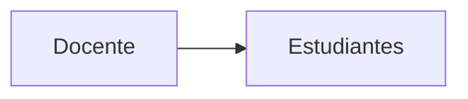
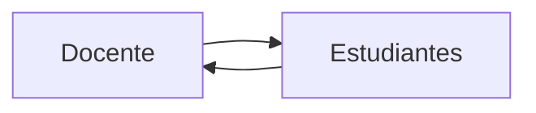
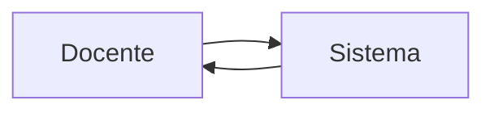
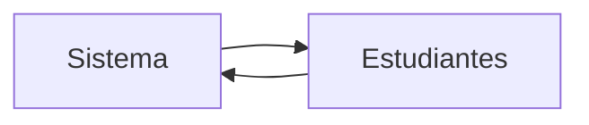
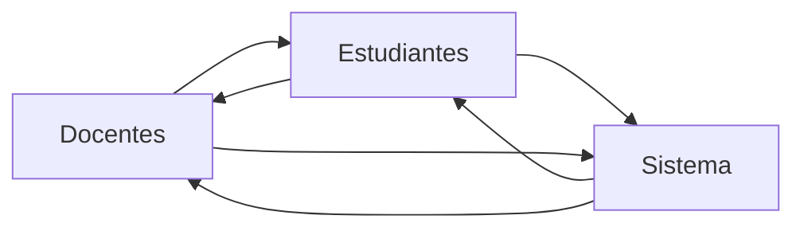

# Justificación del sistema

**Fabián Abarca Calderón** <br>
*Escuela de Ingeniería Eléctrica* <br>
*Universidad de Costa Rica* <br>

> Este desarrollo es parte de un proyecto inscrito en la Vicerrectoría de Docencia de la Universidad de Costa Rica llamado PD-IE-472-2022 "Estrategias docentes para sesiones virtuales interactivas con el desarrollo de un nuevo sistema web: una experiencia en el curso Modelos Probabilísticos de Señales y Sistemas".

Su **objetivo general** es diseñar e implementar un sistema web de presentación de contenidos e interacción entre profesores y estudiantes para sesiones virtuales, dedicado a la enseñanza y aprendizaje de conceptos de probabilidad y estadística para ingeniería eléctrica.

## Descripción del sistema

La siguiente clasificación particular (de elaboración propia) es hecha según los flujos de información y se compone de tres elementos (o "actores"): docente, estudiantes y el "sistema", entendido como una instancia o simulación del objeto de estudio que generalmente será algún tipo de contenido interactivo. En este curso, un ejemplo del "sistema" es la ejecución y visualización de programas de análisis de datos en Python.

1. **Presentar**: información del docente hacia las y los estudiantes.

Ejemplo en el curso: presentación con diapositivas puede incluir la ayuda de material multimedia)

*Diagrama de flujo unidireccional de información:*



2. **Dialogar**: información hacia y desde la o el docente y las y los estudiantes.

Ejemplo en el curso: generalmente utilizando videoconferencia.

*Flujo bidireccional de información:*



3. **Demostrar**: información hacia y desde la o el docente y el sistema, donde las y los estudiantes son observadores.

Ejempli en el curso: generalmente utilizando pantalla compartida, o "screencasting".

*Flujo bidireccional de información:*



4. **Experimentar**: información hacia y desde el sistema y las y los estudiantes.

Ejemplos en el curso: las y los estudiantes manipulan los parámetros de una simulación aleatoria y ven sus resultados.

*Flujo bidireccional de información:*



5. **Colaborar**: información hacia y desde la o el docente, las y los estudiantes y el sistema.

Ejemplo en el curso: docente y estudiantes participación de la creación de una solución programada para un problema de probabilidad.

*Flujo multidireccional de información:*



## Clasificación de sistemas existentes

Como criterio de evaluación de los sistemas existentes y del sistema a desarrollar, con base en la propuesta de este proyecto y en las necesidades del curso, el sistema deseado debe tener las siguientes características:

1. Capacidad de mostrar diapositivas en un **navegador web**, adaptadas para ese medio y para distintas pantallas como monitores, laptops, tabletas o celulares.
2. Capacidad de mostrar diapositivas con **contenido multimedia** como imágenes, audios, videos y animaciones.
3. Capacidad de mostrar diapositivas con **cualquier contenido** usando tecnologías web (HTML, CSS y JavaScript) para expandir las posibilidades de presentación a la gran diversidad de desarrollos existentes en esa esfera.
4. Capacidad de mostrar diapositivas con **interacción** en el que los participantes pueden ingresar datos en preguntas o formularios o cambiar la configuración de la reproducción de multimedia. 
  a. Interacción **básica**: formulario de selección única o múltiple
  b. Interacción **avanzada**: resto de tipos de formularios e interacciones
5. Capacidad de mostrar **contenido matemático**, como fórmulas y otros símbolos, de forma nativa, es decir, con posibilidad de edición y renderización directa en el sistema.
6. Capacidad de integrar herramientas de **visualización de datos**, como gráficas estáticas e interactivas de diversos tipos: gráficos de barras, de líneas, circulares, de puntos, etc.
7. Capacidad de mostrar **código fuente** de forma nativa para discusiones sobre programación y, opcionalmente, la capacidad de editar y ejecutar el código en la misma plataforma (REPL).
8. Capacidad de mostrar **resultados de simulaciones con software** de computación científica de forma nativa, es decir, con posibilidad de importación de datos como tablas, gráficas interactivas, modelos tridimensionales, animaciones, etc.
9. Capacidad de hacer **sesiones remotas** sincrónicas o asincrónicas, con participación de personas desde cualquier dispositivo con un navegador web. En el caso sincrónico, una persona presentadora es capaz de controlar las diapositivas para todos los participantes.
10. Capacidad de **registro de participantes** en una base de datos para almacenamiento de la información de su participación y estadísticas generales de uso.
11. Capacidad de edición de diapositivas con el paradigma **WYSIWYG** (con interfaz de usuario, no con código).
12. Disponible como **software libre**.
13. (Opcional) Capacidad de integrar **videconferencia** dentro del sitio.

El sistema propuesta cae dentro del segmento de plataformas en línea tipo Software-as-a-Service (SaaS), y dentro de dos subcategorías: 1) sistemas de presentaciones en línea y 2) plataformas de aprendizaje digital.

Existe una gran cantidad de opciones disponibles, del orden de cientos, sin embargo, en esta comparación solamente serán analizados los más relevantes o similares por sus objetivos.

Según la lista de características deseables para el sistema propuesto es posible hacer una calificación de estos sistemas analizados:

|                   | 1 | 2 | 3 | 4a | 4b | 5 | 6 | 7 | 8 | 9 | 10 | 11 | 12 | T  |
|-------------------|---|---|---|----|----|---|---|---|---|---|----|----|----|----|
| Reveal.js         | 1 | 1 | 1 | 1  | 1  | 1 | 1 | 1 | 1 | 1 | 0  | 0  | 1  | 11 |
| Slides            | 1 | 1 | 1 | 0  | 0  | 0 | 1 | 1 | 1 | 1 | 0  | 1  | 0  | 8  |
| Nearpod           | 1 | 1 | 0 | 1  | 1  | 0 | 0 | 0 | 0 | 1 | 1  | 1  | 0  | 7  |
| Kahoot!           | 1 | 1 | 0 | 1  | 1  | 0 | 0 | 0 | 0 | 1 | 1  | 1  | 0  | 7  |
| Socrative         | 1 | 1 | 0 | 1  | 1  | 0 | 0 | 0 | 0 | 1 | 1  | 1  | 0  | 7  |
| RELAYTO           | 1 | 1 | 0 | 1  | 1  | 0 | 0 | 0 | 0 | 1 | 1  | 1  | 0  | 7  |
| Mentimeter        | 1 | 1 | 0 | 1  | 1  | 0 | 0 | 0 | 0 | 1 | 1  | 1  | 0  | 7  |
| mmhmm             | 1 | 1 | 1 | 1  | 0  | 0 | 0 | 0 | 0 | 1 | 1  | 1  | 0  | 7  |
| Synthesia         | 1 | 1 | 0 | 1  | 0  | 0 | 0 | 0 | 0 | 1 | 1  | 1  | 0  | 6  |
| Vyond             | 1 | 1 | 0 | 1  | 0  | 0 | 0 | 0 | 0 | 1 | 1  | 1  | 0  | 6  |
| Visme             | 1 | 1 | 0 | 1  | 0  | 0 | 0 | 0 | 0 | 1 | 1  | 1  | 0  | 6  |
| Beautiful.ai      | 1 | 1 | 0 | 1  | 0  | 0 | 0 | 0 | 0 | 1 | 1  | 1  | 0  | 6  |
| Powtoon           | 1 | 1 | 0 | 1  | 0  | 0 | 0 | 0 | 0 | 1 | 1  | 1  | 0  | 6  |
| Colossyan Creator | 1 | 1 | 0 | 1  | 0  | 0 | 0 | 0 | 0 | 1 | 1  | 1  | 0  | 6  |
| Genially          | 1 | 1 | 0 | 1  | 1  | 0 | 0 | 0 | 0 | 1 | 0  | 1  | 0  | 6  |
| Zoom              | 1 | 1 | 0 | 1  | 0  | 0 | 0 | 0 | 0 | 1 | 1  | 0  | 0  | 5  |
| PowerPoint        | 1 | 1 | 0 | 1  | 0  | 0 | 0 | 0 | 0 | 1 | 0  | 1  | 0  | 5  |
| Beamer de LaTeX   | 0 | 0 | 0 | 0  | 0  | 1 | 1 | 1 | 1 | 0 | 0  | 0  | 1  | 5  |
| Prezi             | 1 | 1 | 0 | 0  | 0  | 0 | 0 | 0 | 0 | 1 | 0  | 1  | 0  | 4  |
| Slidebean         | 1 | 1 | 0 | 0  | 0  | 0 | 0 | 0 | 0 | 1 | 0  | 1  | 0  | 4  |
| Canva             | 1 | 1 | 0 | 0  | 0  | 0 | 0 | 0 | 0 | 1 | 0  | 1  | 0  | 4  |

### Sobre la videoconferencia

Esta es una funcionalidad no prioritaria, ya que en principio puede coexistir con Zoom o plataformas similares para la videoconferencia. Sin embargo, existen algunas posibilidades con Jitsi y su [API](https://jitsi.org/api/) gratuito.

> Looking to add video meetings to your site or app? Well, here’s what we believe is the easiest way in the world to do so:

```html
<script src='https://meet.jit.si/external_api.js'></script>
...
const domain = 'meet.jit.si';
const options = {
    roomName: 'PickAnAppropriateMeetingNameHere',
    width: 700,
    height: 700,
    parentNode: document.querySelector('#meet')
};
const api = new JitsiMeetExternalAPI(domain, options);
```

> And that’s it! You can find the full [API](https://jitsi.org/api/) documentation here.
